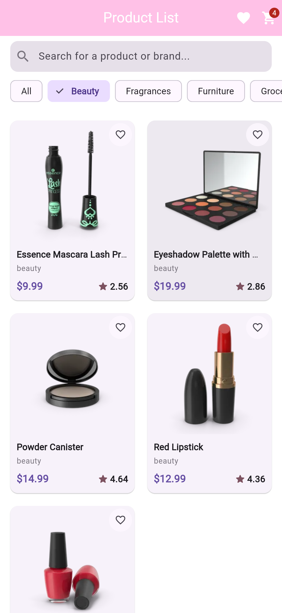
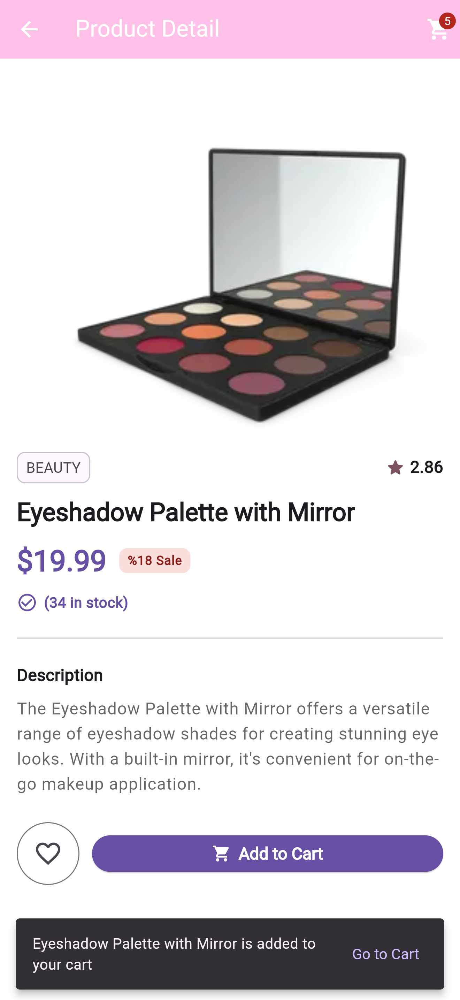
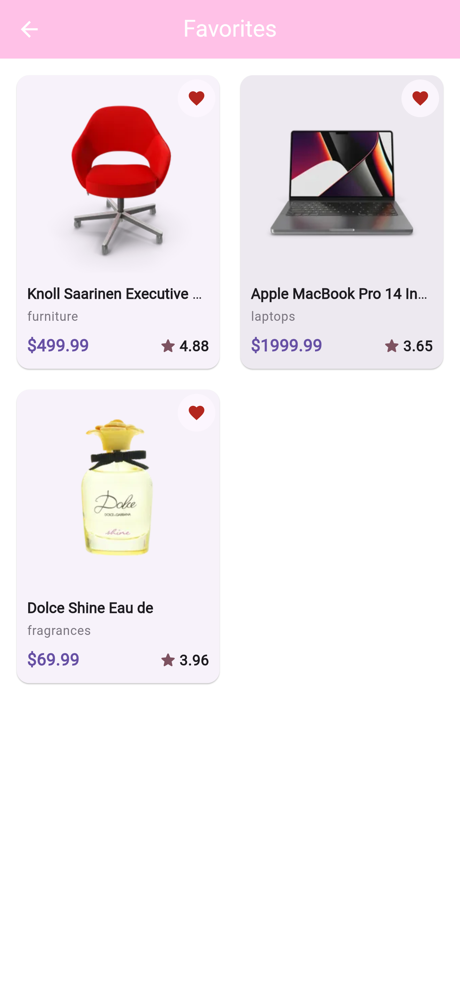
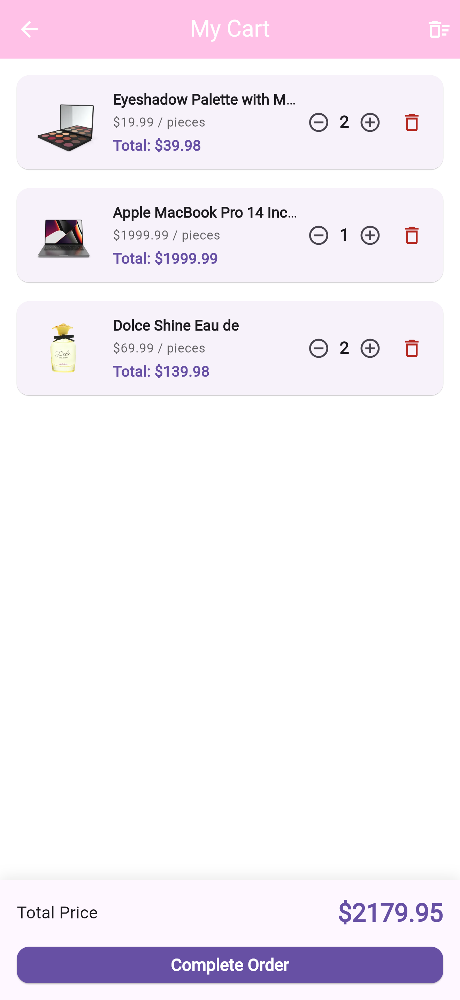
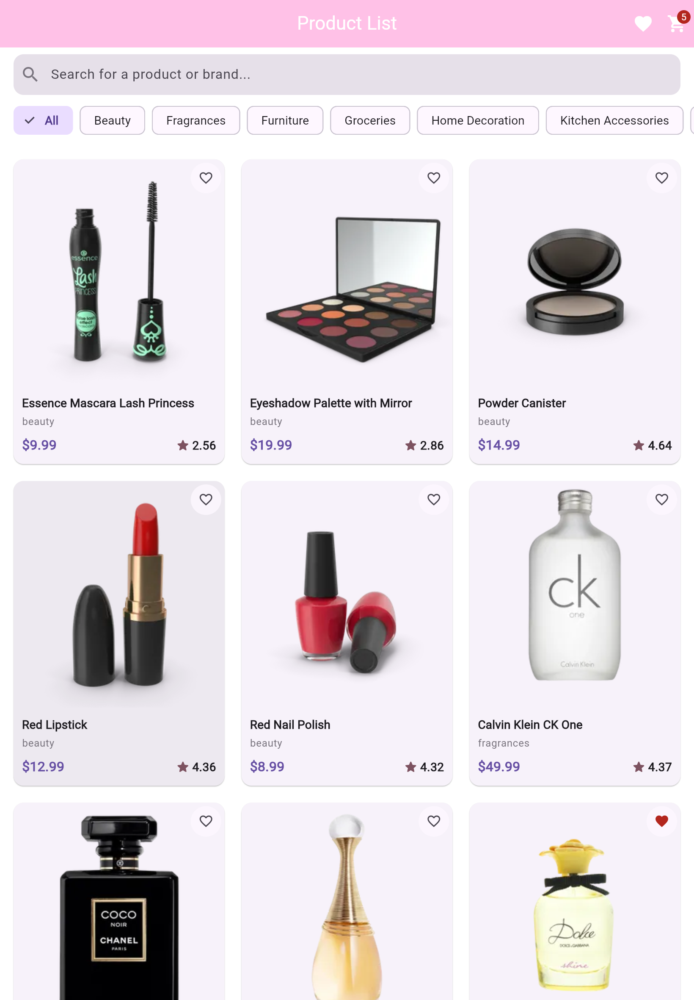

# Mini E-Commerce App

This project is a mobile e-commerce application developed using Flutter as part of an internship program. The aim of the project is not only to develop a working application, but also to experience a real software development process, make correct technical decisions, and establish a sustainable architecture.

## Features

- **Product Discovery & Filtering:** Search bar, category chips, and responsive product grid.
- **Search & Debouncing:** 500ms reactive debouncing to prevent redundant network requests while typing.
- **Product Detail Screen:** Dynamic discount calculation, stock status indicators, detailed descriptions, and responsive media presentation.
- **Favorites Management & Persistence:** Persistent storage via `SharedPreferences` with immediate reactive state synchronization across screens.
- **Cart Management & Persistence:** Quantity adjustments (+ / -), automatic order total calculation, cart persistence across app restarts via `SharedPreferences`, and a dynamic counter badge on the AppBar.
- **Responsive & Adaptive Layout:** Automatic layout adjustments across mobile, tablet, and desktop viewports using adaptive grid counts and dual-pane views.
- **Resilient UI States:** Dedicated Loading, Error (with retry mechanism), and EmptyState components.

---

## Packages & Dependencies

| Package | Version | Purpose |
| :--- | :--- | :--- |
| `flutter_riverpod` | `^2.5.1` | Reactive state management and dependency injection (DI) |
| `dio` | `^5.4.3+1` | HTTP client, base configuration, and network error handling |
| `shared_preferences` | `^2.2.3` | Local key-value persistence for cart and favorites using JSON serialization |
| `go_router` | `^14.0.0` | Declarative routing and deep-linking with route parameters |
| `cached_network_image` | `^3.3.1` | Network image caching, memory optimization, and placeholder rendering |

---

## State Management Approach (Riverpod)

The application relies entirely on **Flutter Riverpod 2.x** for state management, reactive dependency injection, and separating business logic from presentation:

- **Asynchronous Data Handling (`AsyncNotifier` & `FutureProvider`):** 
  Remote API requests (fetching products, searching, filtering) and local persistence streams are encapsulated inside `AsyncNotifier` and `FutureProvider`. This cleanly maps internal states to Flutter UI states using Riverpod's pattern-matching `.when(data: ..., loading: ..., error: ...)` method.
- **Cart State (`CartNotifier` as `AsyncNotifier`):**
  The shopping cart is managed via an immutable `AsyncNotifier<List<CartItemModel>>`. State updates produce new lists rather than mutating existing memory references, ensuring predictable state transitions and automated persistence triggers.
- **Derived / Computed State Providers:**
  - `cartTotalPriceProvider`: Automatically calculates and updates the total price whenever the cart state changes.
  - `cartItemCountProvider`: Aggregates the total quantity of items in the cart to dynamically update the badge count in the AppBar.
- **Rebuild Optimization with `.family`:**
  Favorite toggles on individual cards are observed through `isFavoriteProvider.family(productId)`. This isolates widget rebuilds strictly to the specific card that was tapped, preventing the entire grid from re-rendering.
- **Search Debouncing:**
  A 500ms debounce controller intercepts user keystrokes in the search bar, dispatching queries to the API provider only after typing pauses.

---

## Local Storage Strategy (SharedPreferences)

Local data persistence is built using the **Repository Pattern** on top of `SharedPreferences`, completely decoupling the storage engine from UI widgets:

- **Layer Separation:** UI widgets and Riverpod notifiers do not invoke `SharedPreferences` directly. All read/write operations are mediated through `FavoritesRepository` and `CartRepository`.
- **JSON Serialization:** Both products in favorites and cart line items are serialized into JSON strings via `toJson()` and deserialized back into typed Dart models via `fromJson()`.
- **Cold Start Restoration:** When the app launches, repositories read the saved string lists from device storage and initialize the providers asynchronously, ensuring no loss of user cart or favorite data across app restarts.

---

## API Endpoints Used

The project uses the **DummyJSON API** as its primary remote data source:

* **All Products:** `GET https://dummyjson.com/products`
* **Search Products:** `GET https://dummyjson.com/products/search?q={query}`
* **Category List:** `GET https://dummyjson.com/products/categories`
* **Products by Category:** `GET https://dummyjson.com/products/category/{category}`
* **Product Detail:** `GET https://dummyjson.com/products/{id}`
---

## Architecture & Project Structure

The project follows a **Feature-First** modular architecture:

```text
lib/
├── core/                      
│   ├── constants/             
│   ├── network/                
│   ├── routing/                
│   └── theme/                  
├── features/                   
│   ├── products/               
│   │   ├── data/               
│   │   └── presentation/       
│   ├── favorites/              
│   │   ├── data/              
│   │   └── presentation/      
│   └── cart/                  
│       ├── data/               
│       └── presentation/       
└── main.dart 
``` 

---

## Getting Started & Installation

Follow these steps to run the project locally on your machine.

### Prerequisites
- [Flutter SDK](https://docs.flutter.dev/get-started/install) (version `^3.x` recommended)
- Dart SDK (bundled with Flutter)
- Android Studio / Xcode / VS Code with Flutter extension
- An emulator or physical device connected

### Installation Steps

1. **Clone the repository:**
   ```bash
   git clone [https://github.com/your-username/mini_ecommerce_app.git](https://github.com/your-username/mini_ecommerce_app.git)
   cd mini_ecommerce_app

2. **Install project dependencies:**
    ```bash
    flutter pub get 

3. **Verify the codebase and linting:**
    ```bash
    flutter analyze 

4. **Run the application:**
    ```bash
    flutter run 

---

## Screenshots & Demo

### Mobile View (iPhone 16 Pro Max)

| Product Discovery & Search | Product Detail Screen | Saved Favorites | Persistent Cart & Summary |
| :---: | :---: | :---: | :---: |
|  |  |  |  |

---

### Responsive & Adaptive View

<p align="center">
  
</p>
